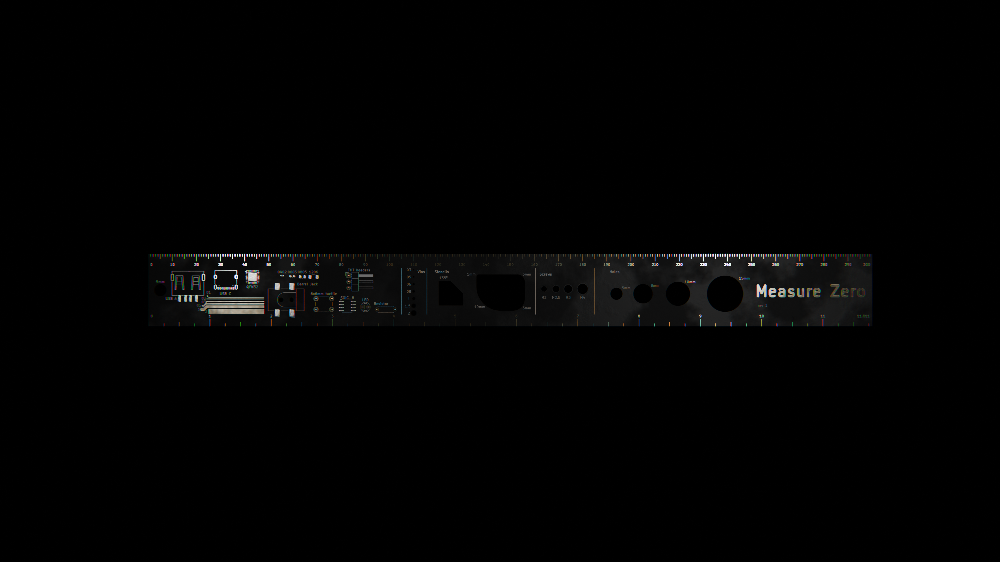

# Measure Zero

An opinionated 300mm PCB ruler.

## 2026-06-29: Made a render and wrote the docs

**Total time spent: 0.6 hours**

Started at 5:20 and finished at 5:56 in the continuous sit-down session, so I'll give myself  36 minutes (it's a bit more so this is a conservative estimate)

Yeah I made the renders in blender, which was cool. This project is all about polish so I tried to make them good. I learned about compositing and added subtle chromatic aberration, which gives it a nice effect. 

Then I just went through the requirements, priced it out in JLC, and wrote the README. 

# 2026-06-29: Made the back pattern

**Total time spent: 0.6 hours**

Soo I learned about how solder mask works. Fr4 is not colored, the color of pcbs comes from solder mask, so I had to manually-ish copy over all the F.cu onto F.mask (which is the negative mask layer.) For some reason it looked fine in kicad and I only realized this when I tried to preview gerbers in jlc. Bruh.

So then I made this crazy hexagon design on the back that I personally think looks really cool. 

And yes, I vibe-coded a script to generate the SVGs to import. 

Anyways, this was more time spent fiddling with layers than I thought. Also I drew some of my graphics as traces and not lines on F.cu, and those can't be copied because kicad smartly says that traces are for copper layers only, not for copying to negative mask layers, so I had to like manually redraw them on the mask layer with the line tool. 

# 2026-06-28: Minor tweaks

**Total time spent: 0.3 hours**

Some layout and stuff. Added the 45 degree stencil. Cut the 20mm circle. Added the title. Added a barrel jack. Tweaked spacing. It's looking good. 

# 2026-06-28: First pass on the PCB

**Total time spent: 2.19 hours**

I timed myself for this session and worked continuously inside those time blocks.

started at 1:57

stopped at 2:18

started at 2:29

ended 3:20

Anyways, I laid everything out! 

It's obviously not perfect, I'll tweak some alignments, but it's looking decently balanced overall and I put in all the features. Here's what it looks like in the kicad 3d viewer (I will make a sick blender render later of course)

One thing I learned about was the "edit text and graphics" kicad button. Used it to change all my ruler markings to be on F.cu when I was initially designing on the silkscreen layer. Anyways gold plated enig with that is going to look fire. Exciting times

# 2026-06-28: Started the project and brainstormed things to put on it

**Total time spent: 0.5 hours**

I did a bit of research, like the digikey ruler, the jlc ruler, and also foss rulers (shoutout to NotARoomba/trace, amazing hack clubber pcb ruler !!!)

here's my plan for things to put on there:

 - metric-first, but make it one foot/30 cm with mm gradations. Maybe also have inch markings to the quarter on the opposite side
  - measurement markings in enig
 - via holes for the common sizes you'll encounter
 - via holes as circle templates in big sizes (m3, multiples of five mm up to 20, etc)
 - a keyring hole
 - typical footprints drawn as silkscreen? qfn chip, usb a and c ports, all the classic  
 - sizes of smd passives (0402 etc), common tht components (led, resistor, cap)
 - ROUNDED CORNER TEMPLATES (pcb-adjacent, but super nice to have when drafting)
 - maybe a 45 degree template?
 - isometric design on the back

I started the kicad project but it's empty, but here's an image

I also priced it out using JLC's quote tool. The good news? The oversize 300x30mm does not add very much cost. The bad news? ENIG does. But it's worth it for the cool look. Splitting up journal entries semantically for me actually doing the pcb layout
