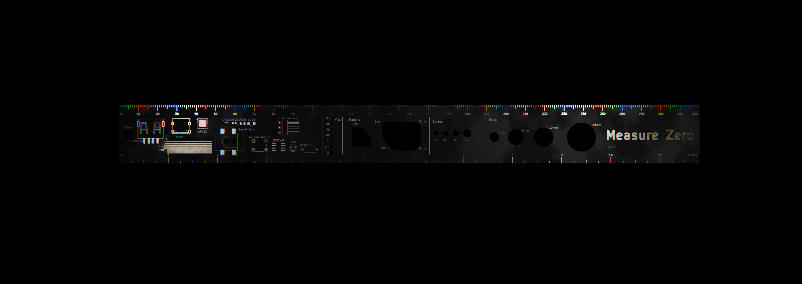
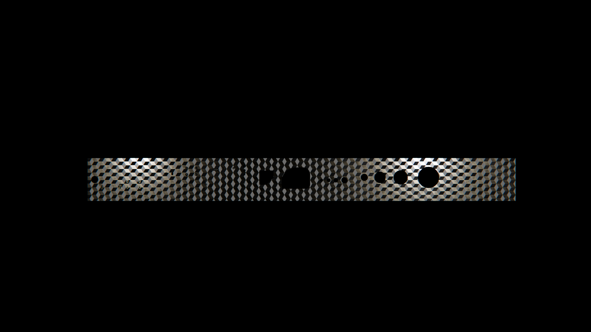
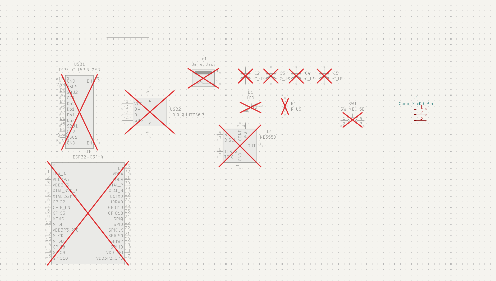
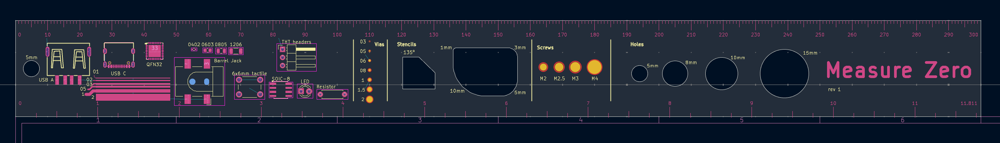
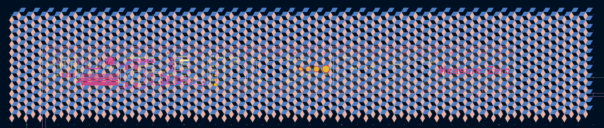
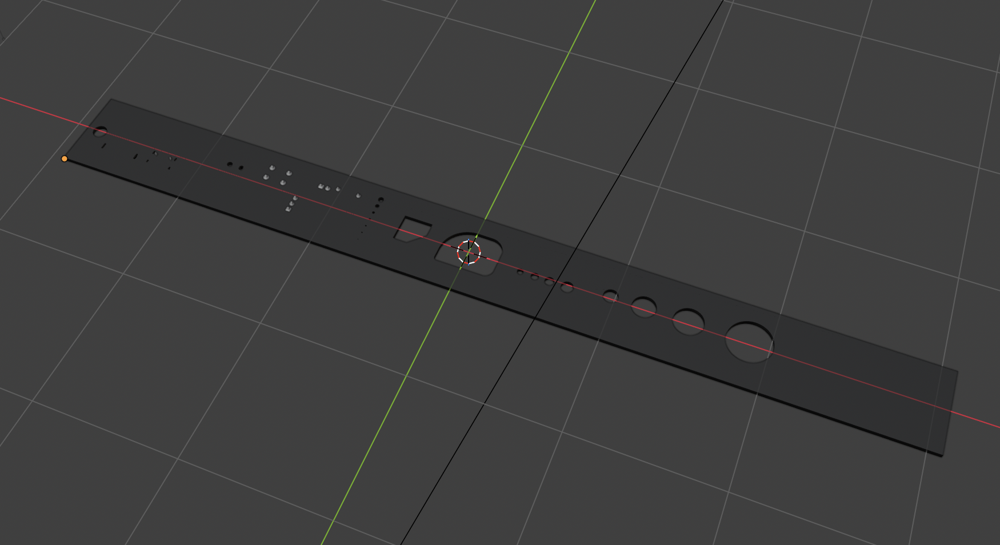
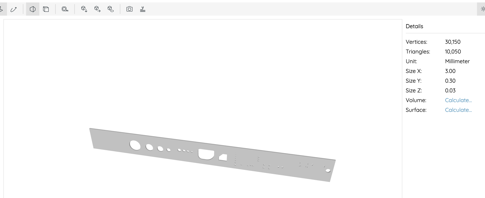

# measure-zero

An opinionated 300mm PCB ruler. It has:

 - mm tick marks
 - quarter-inch tick marks 
 - Footprints of common parts
 - Common vias
 - **Angle and rounded corner stencils**
 - Common screw holes
 - Other holes for tracing
 - A keychain hole
 - ENIG finish
 - Isometric tricolor hexagon design on the back

 

 ## Why I made this project

 I just thought that a PCB ruler would be pretty cool yo. And I think this one is. It's also not crazy expensive, $25 for 5pcs, with the fancy ENIG finish. I thought this project would be really simple, but I still learned some interesting things. And I spent a lot more time in the kicad silkscreen layer than I have before. I learned about "Edit Text and Graphics Properties," which was an absolute life saver for putting moving and copying graphics onto different layers. Also because I decided to add an inch scale I had to switch between grid sizes, which was a bit painful. But I made something cool in the end.

 ## Schematic

 

 ## PCB

 

 With overflowing back design:

 

 ## A screenshot of a full 3D model with my project

 The render I guess, here it is in blender and here it is in a STEP viewer

 
 

## BOM

|Item      |Link|Cost  |
|----------|----|------|
|PCB       |N/A |25.94 |
|Shipping  |N/A |3.3   |
|Taxes     |N/A |3     |
|Total Cost|N/A |32.24 |
